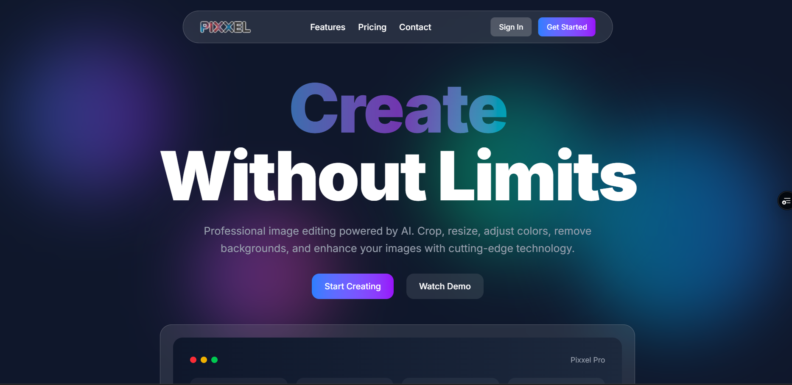

# 🎨 Pixxel - AI-Powered Image Editor

> **Live Demo:** [https://pixel-edit-smoky.vercel.app/](https://pixel-edit-smoky.vercel.app/)



## 🚀 What is Pixxel?

Pixxel is a modern, web-based image editing SaaS application that harnesses the power of AI to transform your images effortlessly. Built with cutting-edge technologies, it offers professional-grade editing tools with an intuitive interface.

### ✨ Key Features

- **🤖 AI Background Removal** - Automatically remove backgrounds with precision
- **🎬 AI Background Replacement** - Generate custom backgrounds using AI prompts  
- **✂️ Smart Crop** - AI-powered intelligent cropping with face and object detection
- **📐 Advanced Resizing** - Maintain quality while resizing with aspect ratio presets
- **🎨 Canvas Editor** - Professional Fabric.js-based editing environment
- **🖼️ Background Library** - Browse and apply high-quality Unsplash images
- **💾 Real-time Sync** - Auto-save projects with instant updates
- **👤 User Authentication** - Secure sign-in with Clerk
- **📱 Responsive Design** - Works seamlessly across all device sizes

## 🛠️ Tech Stack

### **Frontend**
- **Next.js 13+** - React framework with App Router
- **React 18** - UI library with hooks and context
- **Fabric.js 6.7** - Canvas manipulation and image editing
- **Tailwind CSS** - Utility-first styling
- **Shadcn/ui** - Modern component library
- **Lucide React** - Beautiful icons

### **Backend & Services**
- **Convex** - Real-time database and backend
- **Clerk** - Authentication and user management
- **ImageKit** - AI transformations and CDN
- **Unsplash API** - High-quality stock photos

### **AI & Image Processing**
- **ImageKit AI** - Background removal, enhancement, smart cropping
- **Canvas API** - Client-side image manipulation
- **WebGL** - Hardware-accelerated rendering

## 🏗️ Architecture & Learning Highlights

### **Canvas-First Architecture**
```
User Upload → Fabric.js Canvas → AI Processing → Real-time Updates
```

### **Key Technical Learnings**

1. **Advanced Canvas Management**
   - Implemented complex Fabric.js object handling
   - Built custom viewport scaling for responsive design
   - Managed image transformations with proper coordinate systems

2. **AI Integration Patterns**
   - Constructed clean ImageKit transformation URLs
   - Handled async image processing with loading states
   - Implemented fallback strategies for API failures

3. **Real-time State Management**
   - Built React Context for canvas operations
   - Implemented optimistic UI updates
   - Synchronized canvas state with database

4. **Performance Optimizations**
   - Debounced auto-save functionality
   - Optimized image loading with proper caching
   - Implemented efficient re-rendering strategies

## 🚀 Getting Started

### Prerequisites
- Node.js 18+ and npm
- Accounts for: Clerk, Convex, ImageKit, Unsplash (optional)

### Installation

1. **Clone the repository**
   ```bash
   git clone https://github.com/yourusername/pixxel-editor.git
   cd pixxel-editor
   ```

2. **Install dependencies**
   ```bash
   npm install
   ```

3. **Set up environment variables**
   Create `.env.local` file:
   ```env
   # Clerk Authentication
   NEXT_PUBLIC_CLERK_PUBLISHABLE_KEY=pk_test_xxx
   CLERK_SECRET_KEY=sk_test_xxx
   
   # Convex Database  
   NEXT_PUBLIC_CONVEX_URL=https://xxx.convex.cloud
   
   # ImageKit AI
   NEXT_PUBLIC_IMAGEKIT_PUBLIC_KEY=public_xxx
   NEXT_PUBLIC_IMAGEKIT_URL_ENDPOINT=https://ik.imagekit.io/xxx
   
   # Unsplash (Optional)
   NEXT_PUBLIC_UNSPLASH_ACCESS_KEY=xxx
   ```

4. **Set up Convex**
   ```bash
   npx convex dev
   ```

5. **Run development server**
   ```bash
   npm run dev
   ```

Visit [http://localhost:3000](http://localhost:3000) to see the app.

## 📁 Project Structure

```
app/
├── (auth)/              # Authentication routes
├── (main)/
│   ├── dashboard/       # Project management
│   └── editor/          # Canvas editor
│       └── [projectId]/
│           └── _components/
│               └── _tools/   # Editing tools
├── api/                 # API routes
└── globals.css          # Global styles

components/
├── ui/                  # Shadcn components
└── [feature-components] # Landing page components

convex/                  # Database schema & functions
hooks/                   # Custom React hooks
lib/                     # Utilities
context/                 # React Context providers
```

## 🔧 Key Implementation Details

### **Canvas Editor Architecture**
- **Fabric.js Integration**: Custom hooks for canvas lifecycle
- **Responsive Scaling**: Dynamic viewport calculations
- **State Management**: Context-based tool coordination

### **AI Tool Implementation**  
- **URL Construction**: Clean base URL strategy prevents conflicts
- **Error Handling**: Graceful degradation for API limits
- **Loading States**: Coordinated UI feedback across tools

### **Database Design**
- **Project Schema**: Efficient storage of canvas states
- **Real-time Updates**: Optimistic UI with Convex mutations
- **File Management**: ImageKit CDN integration

## 🚀 Deployment

### Build for Production
```bash
npm run build
npm start
```

### Deploy to Vercel
1. Connect your GitHub repository to Vercel
2. Add environment variables in Vercel dashboard
3. Deploy automatically on push to main branch

## 🤝 Contributing

1. Fork the repository
2. Create feature branch (`git checkout -b feature/amazing-feature`)
3. Commit changes (`git commit -m 'Add amazing feature'`)
4. Push to branch (`git push origin feature/amazing-feature`)
5. Open a Pull Request

## 📝 License

This project is licensed under the MIT License - see the [LICENSE](LICENSE) file for details.

## 🙏 Acknowledgments

- **ImageKit** for powerful AI image transformations
- **Convex** for seamless real-time backend
- **Clerk** for robust authentication
- **Fabric.js** for incredible canvas capabilities
- **Unsplash** for beautiful stock photography

---

Built with ❤️ using Next.js, AI, and modern web technologies.
