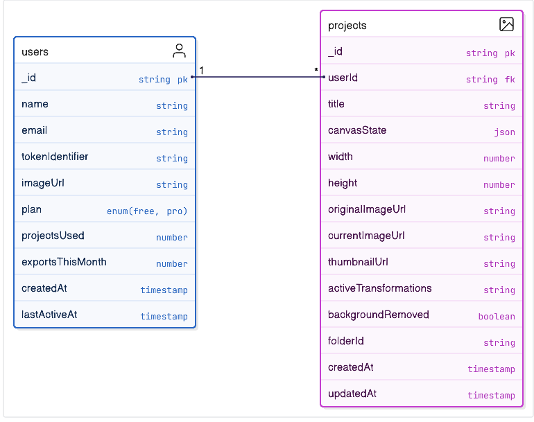

#  Backend - Architecture

## 1. Convex

### 1.1 Setup
```bash
npm install convex

npx convex dev
// and save your production and deployment URLs.
```

### 1.2 Terminology
**Core Concepts:**
* **Function**: Live API call you make to Convex database
* **Query**: Function type for reading/getting data (read-only)
* **Mutation**: Function type for writing/changing data (create, update, delete)

#### Example:
##### Query:
```jsx
// In the convex/ folder, add a new file tasks.ts with a query function that loads the data.

// Exporting a query function from this file declares an API function named after the file and the export name: api.tasks.get

import { query } from "./_generated/server";

export const get = query({
  args: {},
  handler: async (ctx) => {
    return await ctx.db.query("tasks").collect();
  },
});
```

##### Mutation:
```jsx
import { mutation } from "./_generated/server";
import { v } from "convex/values";

export const create = mutation({
  args: {
    title: v.string(),
    description: v.string(),
  },
  handler: async (ctx, args) => {
    const taskId = await ctx.db.insert("tasks", {
      title: args.title,
      description: args.description,
      createdAt: Date.now(),
    });
    return taskId;
  },
});
```

### 1.2 Database Schema



### 1.3 Authentication & User Management

#### 1.3.1 Clerk & Convex JWT Integration

**Configuration (`convex/auth.config.js`):**
```javascript
export default {
  providers: [
    {
      domain: process.env.CLERK_JWT_ISSUER_DOMAIN,
      applicationID: "convex",
    },
  ]
};
```

**How JWT Integration Works:**
1. User signs in with Clerk → Clerk generates JWT token
2. Frontend sends requests to Convex → JWT token included in headers
3. Convex validates JWT → Checks against configured Clerk domain
4. Token verified → `ctx.auth.getUserIdentity()` returns user data
5. Secure API access → Backend functions can trust user identity

#### 1.3.2 Backend User Functions (`convex/users.js`)

**Store User Mutation:**
```javascript
export const store = mutation({
  args: {}, // No args needed - gets data from JWT
  handler: async (ctx) => {
    // Get authenticated user from Clerk JWT
    const identity = await ctx.auth.getUserIdentity();
    
    // Check if user already exists in database
    const user = await ctx.db
      .query("users")
      .withIndex("by_token", (q) =>
        q.eq("tokenIdentifier", identity.tokenIdentifier)
      )
      .unique();

    if (user !== null) {
      // Update name if changed in Clerk
      if (user.name !== identity.name) {
        await ctx.db.patch(user._id, { name: identity.name });
      }
      return user._id;
    }

    // Create new user with default settings
    return await ctx.db.insert("users", {
      name: identity.name ?? "Anonymous",
      tokenIdentifier: identity.tokenIdentifier,
      email: identity.email,
      imageUrl: identity.pictureUrl,
      plan: "free",
      projectsUsed: 0,
      exportsThisMonth: 0,
      createdAt: Date.now(),
      lastActiveAt: Date.now(),
    });
  },
});
```

**Get Current User Query:**
```javascript
export const getCurrentUser = query({
  handler: async (ctx) => {
    const identity = await ctx.auth.getUserIdentity();
    if (!identity) return null;

    return await ctx.db
      .query("users")
      .withIndex("by_token", (q) =>
        q.eq("tokenIdentifier", identity.tokenIdentifier)
      )
      .unique();
  },
});
```

#### 1.3.3 Frontend Integration

**Custom Hook (`hooks/use-store-user.jsx`):**
```javascript
export function useStoreUser() {
  // Monitor Clerk authentication state
  const { isLoading, isAuthenticated } = useConvexAuth();
  const { user } = useUser(); // Clerk user data
  
  // Local state for database user ID
  const [userId, setUserId] = useState(null);
  
  // Reference to backend store function
  const storeUser = useMutation(api.users.store);

  // Automatic user storage on authentication
  useEffect(() => {
    if (!isAuthenticated) return;

    async function createUser() {
      const id = await storeUser(); // Calls backend
      setUserId(id); // Store local reference
    }
    createUser();
    
    return () => setUserId(null);
  }, [isAuthenticated, storeUser, user?.id]);

  // Combined loading/auth state for UI
  return {
    isLoading: isLoading || (isAuthenticated && userId === null),
    isAuthenticated: isAuthenticated && userId !== null,
  };
}
```

#### 1.3.4 Automatic Authentication Detection

**How Change Detection Works:**

1. **React Hook Subscriptions**: 
   - `useUser()` watches Clerk authentication state
   - `useConvexAuth()` monitors Convex connection status
   - Both hooks trigger re-renders when state changes

2. **useEffect Dependency Tracking**:
   ```javascript
   useEffect(() => {
     // Runs when any dependency changes
   }, [isAuthenticated, storeUser, user?.id]);
   ```

3. **Authentication State Timeline**:
   ```
   Time: 0s → User not signed in
         ↓
   Time: 1s → User clicks "Sign In"
         ↓
   Time: 2s → Clerk completes authentication
         ↓   isAuthenticated: false → true (triggers useEffect)
   Time: 3s → useEffect runs storeUser()
         ↓
   Time: 4s → Backend creates/updates user record
         ↓
   Time: 5s → Frontend receives user ID, sets userId state
         ↓
   Time: 6s → UI shows authenticated state
   ```

**Trigger Scenarios:**
- **First sign-in**: `isAuthenticated` changes from `false` to `true`
- **Sign-out then sign-in**: Authentication state cycles, triggers effect
- **Account switching**: `user?.id` changes, triggers user storage for new account
- **Page refresh**: Hook re-initializes, ensures user is stored

#### 1.3.5 Frontend Usage

**App-Level Authentication:**
```javascript
function App() {
  const { isLoading, isAuthenticated } = useStoreUser();
  
  if (isLoading) return <LoadingSpinner />;
  if (!isAuthenticated) return <SignInPage />;
  
  return <Dashboard />; // User fully authenticated & stored
}
```

**Protected Components:**
```javascript
function Dashboard() {
  const { data: user } = useConvexQuery(api.users.getCurrentUser);
  const { data: projects } = useConvexQuery(api.projects.getUserProjects);
  
  return (
    <div>
      <h1>Welcome {user?.name}</h1>
      <ProjectList projects={projects} />
    </div>
  );
}
```

### 1.4 Project Management Functions (`convex/projects.js`)

**Get User Projects Query:**
```javascript
export const getUserProjects = query({
  handler: async (ctx) => {
    const identity = await ctx.auth.getUserIdentity();
    if (!identity) throw new Error("Not authenticated");

    const user = await ctx.db
      .query("users")
      .withIndex("by_token", (q) => q.eq("tokenIdentifier", identity.tokenIdentifier))
      .unique();

    if (!user) throw new Error("User not found");

    return await ctx.db
      .query("projects")
      .withIndex("by_user_updated", (q) => q.eq("userId", user._id))
      .order("desc")
      .collect();
  },
});
```

**Create Project Mutation:**
```javascript
export const create = mutation({
  args: {
    title: v.string(),
    originalImageUrl: v.optional(v.string()),
    currentImageUrl: v.optional(v.string()),
    thumbnailUrl: v.optional(v.string()),
    width: v.number(),
    height: v.number(),
    canvasState: v.optional(v.any()),
  },
  handler: async (ctx, args) => {
    const identity = await ctx.auth.getUserIdentity();
    if (!identity) throw new Error("Not authenticated");

    const user = await ctx.db
      .query("users")
      .withIndex("by_token", (q) => q.eq("tokenIdentifier", identity.tokenIdentifier))
      .unique();

    if (!user) throw new Error("User not found");

    // Check plan limits
    const projectCount = await ctx.db
      .query("projects")
      .withIndex("by_user", (q) => q.eq("userId", user._id))
      .collect();

    if (user.plan === "free" && projectCount.length >= 3) {
      throw new Error("Free plan limited to 3 projects");
    }

    const projectId = await ctx.db.insert("projects", {
      title: args.title,
      userId: user._id,
      originalImageUrl: args.originalImageUrl,
      currentImageUrl: args.currentImageUrl,
      thumbnailUrl: args.thumbnailUrl,
      width: args.width,
      height: args.height,
      canvasState: args.canvasState,
      createdAt: Date.now(),
      updatedAt: Date.now(),
    });

    // Update user's project count
    await ctx.db.patch(user._id, {
      projectsUsed: projectCount.length + 1,
      lastActiveAt: Date.now(),
    });

    return projectId;
  },
});
```

## Some crucial DB Hooks info during unmounting

### What "Effect Unmounts" Means:

When a React component is removed from the DOM (unmounted), any running effects need to be cleaned up to prevent:

*Memory leaks
*State updates on destroyed components
*Stale references

##### The Cleanup Code
``` jsx
useEffect(() => {
  if (!isAuthenticated) return;

  async function createUser() {
    const id = await storeUser();
    setUserId(id);
  }
  createUser();

  // 🧹 CLEANUP FUNCTION - runs when effect unmounts
  return () => setUserId(null);
  //     ↑ This is the cleanup function
}, [isAuthenticated, storeUser, user?.id]);
```

##### When Cleanup Happens

Scenario 1: Component Unmounts
``` jsx
// User navigates away from the app
<App> // Component using useStoreUser
  ↓ User clicks "back" or closes tab
<Nothing> // Component destroyed

// Cleanup runs: setUserId(null)
```

Scenario 2: Dependencies Change
``` jsx
// User switches accounts
useEffect(() => {
  // Old effect cleanup runs first: setUserId(null)
  // Then new effect runs for new user
}, [isAuthenticated, storeUser, user?.id]);
//                              ↑ user?.id changed
```


## uploading Image Data


```jsx
const formData = await request.formData(); // ggets file from formdata send by frontend through req params
const file = formData.get("file"); // fomrdata is object so gets file
const fileName = formData.get("fileName");

if (!file || !fileName) {
    return NextResponse.json({ error: "File and fileName are required" }, { status: 400 });
}

// filteration of files same for most types of file
const bytes = await file.arrayBuffer();
const buffer = Buffer.from(bytes);

const timestamp = Math.floor(Date.now() / 1000);
const santinzedFileName = 
fileName?.replace(/[^a-zA-Z0-9.-]/g, "_") || `upload_${timestamp}`;
```

#forntend code to send file
``` jsx

const onDrop = useCallback((acceptedFiles) => {
    const file = acceptedFiles[0];
    if (file) {
      setSelectedFile(file);
      setPreviewUrl(URL.createObjectURL(file));

      // Auto-generate title from filename
      const nameWithoutExt = file.name.replace(/\.[^/.]+$/, "");
      setProjectTitle(nameWithoutExt || "Untitled Project");
    }
  }, []);
  
/// using dropzone 
 const { getRootProps, getInputProps, isDragActive } = useDropzone({
    onDrop,
    accept: {
      "image/*": [".png", ".jpg", ".jpeg", ".webp", ".gif"],
    },
    maxFiles: 1,
    maxSize: 20 * 1024 * 1024, // 20MB limit
  });

const formData = new FormData();
      formData.append("file", selectedFile);
      formData.append("fileName", selectedFile.name);

      const uploadResponse = await fetch("/api/imagekit/upload", {
        method: "POST",
        body: formData,
      });
```